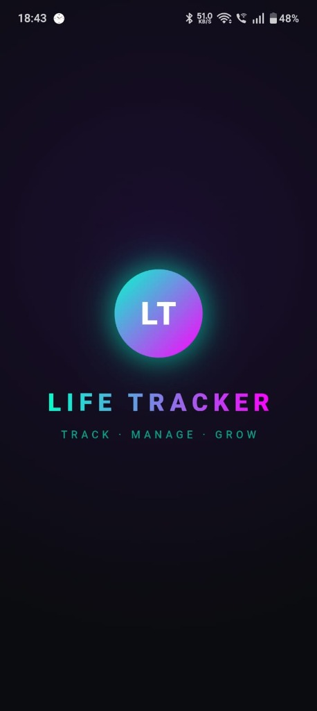
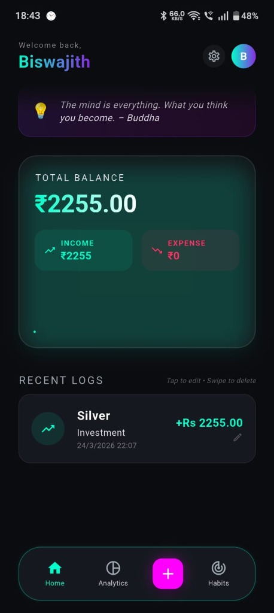
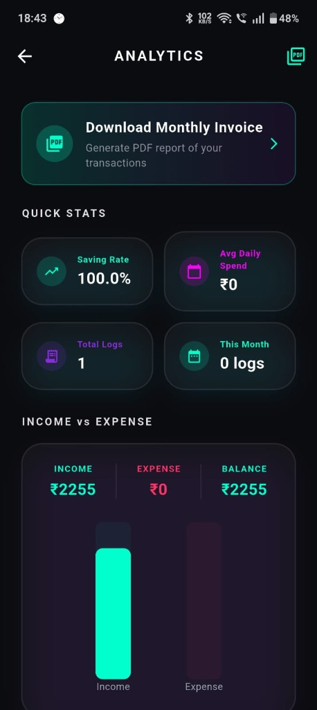
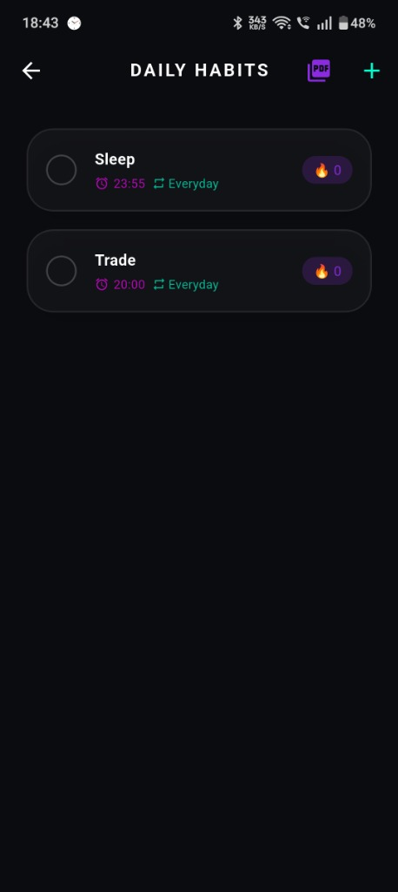

# 🌿 Life Tracker App

> A sleek, offline-first Life Tracker built with Flutter 🚀  
> Manage your expenses, habits, and daily productivity in one simple app.

---

## ✨ App Preview



---

## 📱 Features

- 💰 Expense Tracker (Offline storage)
- 📊 Simple Analytics Dashboard
- 🔥 Habit Tracker with streak system
- 🎯 Daily Goals & Task Manager
- 💾 Local Storage (No internet required)
- 📱 Clean & Modern UI Design
- 🌙 Dark Mode Support

---

## 🧠 Tech Stack

- Flutter 💙  
- Dart 🎯  
- SQLite / Local Storage 📦  
- Shared Preferences 💾  

---

## 📸 UI Screenshots

| Dashboard | Analytics | Habits |
|----------|----------|--------|
|  |  |  |

---

## 🚀 Getting Started

```bash
git clone https://github.com/BiswajithPN/Life-Tracker.git
cd life-tracker
flutter pub get
flutter run
```
